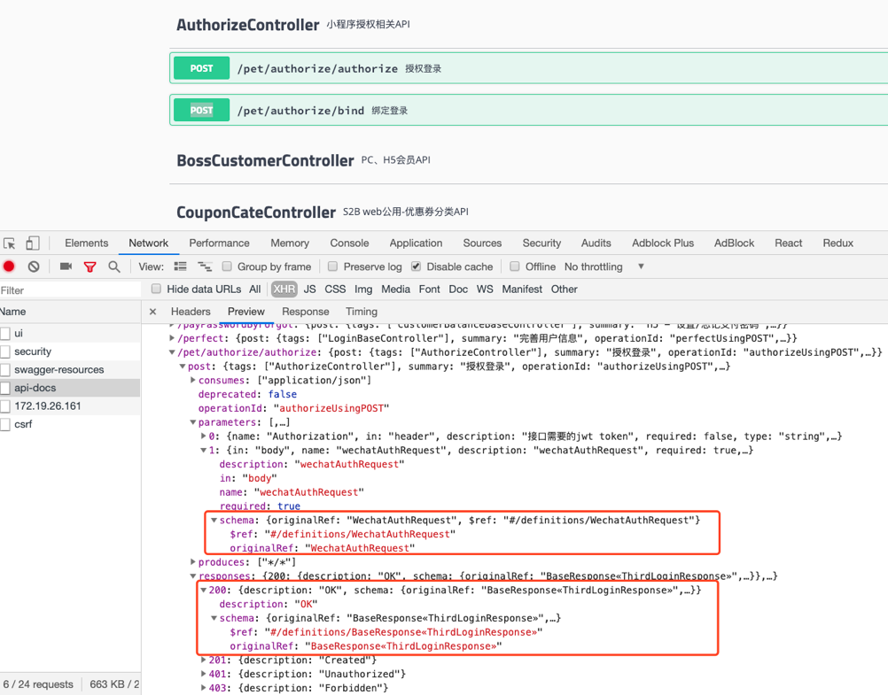
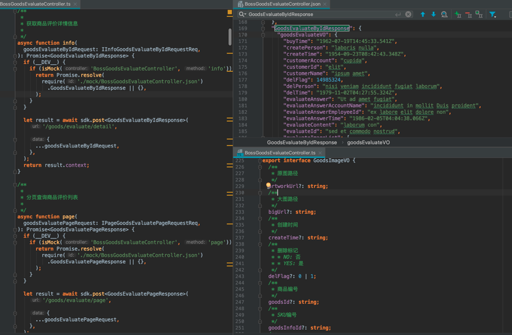

# moon
代号月球, 做一些辅助工作,  (月球)

## 发布
lerna publish

## TODO

- [x] api自动生成;
- [ ] 可视化操作生成页面结构;
- [ ] 把electron调起来;
- [ ] 服务端项目起一个出来;
- [ ] 可视化生成布局信息代码;
- [ ] 服务化功能组件使用;
    - [ ]建站;
    - [ ]用户管理;

##应用场景

### 场景1: api自动生成;
根据yapi  swagger中api的定义生成客户端可以调用的api,并且把mock数据等流程嵌入进来;

eg:
swagger中api定义如下.
;

经过moon工具生成代码结构如下:
```shell
.
├── AuthorizeController.ts
├── CouponCodeBaseController.ts
├── CouponInfoController.ts
├── CustomerBaseController.ts
├── PetCouponInfoController.ts
├── StoreCustomerController.ts
├── _api-info.json
├── fetch.ts
├── index.ts
├── mock
│   ├── AuthorizeController.json
│   ├── CouponCodeBaseController.json
│   ├── CouponInfoController.json
│   ├── CustomerBaseController.json
│   ├── PetCouponInfoController.json
│   └── StoreCustomerController.json
└── mock-util.ts

```

对应单个controller如下图所示,

;


#### 总结

    moon中api生成工具可以代替人力出色生成调用代码,不但包括mock数据,bean对应的ts结构,还包括备注信息;而且日后的同步工作也省了;


## 场景1: 生成taro页面skeleton

参考代码:/Users/dong/Falcon/moon/app/src/core/page/taro-redux/index.ts

## 场景3: 定义modal,自动生成服务端, 及客户端代码;


## 开发流程

1. 按页面类型来做页面. 列表 表单, 展示;

2.


## 项目工作量定制

1. 按页面算;
 高中低
 一个页面0.5天 前端切页面.
 对接口. 一个人一天对3个页面.

2. 按领域算;

3. 按功能算;